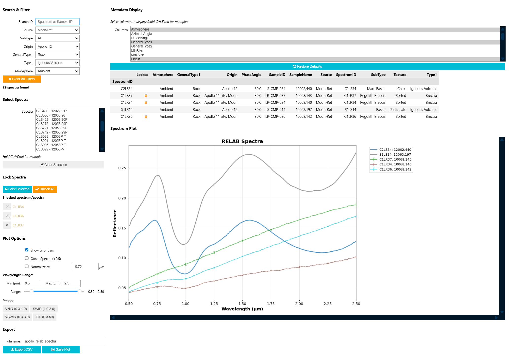

# pyspectacle

A Python package for parsing and browsing spectroscopy databases. 



Note: this is an early prototype and may break or be unsupported! Currently only supports the RELAB database.

### Quickstart

1. Download the RELAB database from https://sites.brown.edu/relab/relab-spectral-database/
2. Unzip the database
3. Install `pyspectacle` (see below)
4. Launch the interactive browser in Jupyter and run the following (update path accordingly):

```python
from pyspectacle import RelabParser, SpectraBrowser
database_path = '/path/to/unzipped/RelabDB/'
parser = RelabParser(database_path)
browser = SpectraBrowser(parser)
browser.display()
```

## Installation

### With UV (recommended)

Install directly from GitHub, this will setup all dependencies. You just need uv [link](https://docs.astral.sh/uv/#installation):

```bash
uv pip install git+https://github.com/cjtu/pyspectacle.git
```

### Simplest (pip)

Install directly from GitHub. Recommended to install in a conda env or (uv) venv as above.

```bash
pip install git+https://github.com/cjtu/pyspectacle.git
```


### Clone from GitHub (dev setup)

Alternatively you can clone the repo and install with uv:

```bash
git clone https://github.com/cjtu/pyspectacle.git
cd pyspectacle
uv pip install -e .
```

### Troubleshooting

For interactive Jupyter widgets, you may also need to run:

```bash
jupyter nbextension enable --py widgetsnbextension
```


### Programmatic API

```python
from pyspectacle import RelabParser

# Initialize parser
parser = RelabParser('/path/to/RelabDB/')

# List available spectra with filters
spectra = parser.list_spectra(Source='Moon-Ret', SubType='Basalt')

# Retrieve single spectrum
reflectance, std_dev, metadata = parser.get_spectrum('C1MM05')

# Batch retrieve spectra with interpolation
refl_df, std_df, meta_df = parser.get_spectra_batch(
    ['C1MM05', 'C1MM06'], 
    wavelength_grid=np.arange(0.3, 2.6, 0.01)
)
```

See [examples/api_example.ipynb](examples/api_example.ipynb) for more examples.

## Features

- **Interactive GUI**: Filter, select, plot, and export spectra with an intuitive widget interface
- **Flexible Queries**: Filter by Source, SubType, Origin, PI, and more
- **Batch Processing**: Retrieve multiple spectra with automatic wavelength interpolation
- **Metadata Management**: Join sample and spectra catalogues for comprehensive metadata
- **Data Export**: Export reflectance, standard deviation, and metadata to CSV
- **Visualization**: Plot spectra with normalization, error bars, and offset options

## Testing

Run tests with pytest. Note: Test database paths are hardcoded and need manual updates.

```bash
pytest tests/test_pyspectacle.py -v
```

Or run quick validation:

```bash
python tests/test_quick.py
```

## License

This parser and viewer is provided as-is under the MIT license with no warranties. 

If using to parse spectral libraries like RELAB, please cite them appropriately in publications, e.g.:

> Pieters, Carlé M., and Takahiro Hiroi. "RELAB (Reflectance Experiment Laboratory): A NASA multiuser spectroscopy facility." Lunar and Planetary Science Conference. 2004.

> Pieters, Carlé M. "Strength of mineral absorption features in the transmitted component of near‐infrared reflected light: First results from RELAB." Journal of Geophysical Research: Solid Earth 88.B11 (1983): 9534-9544.